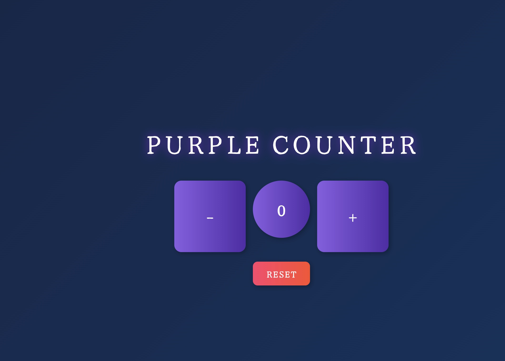

# JS-PROJECT

# JavaScript Basics Project: Purple Counter

A simple JavaScript application that allows the user to increase and decrease the value of a counter.

# Link
https://velvety-boba-765a82.netlify.app/

# Usage

The user, upon entering the page, will display 0 as the counter value and will have the two following buttons to change the counter value:

button [+] increases by 1 the value of the counter
button [-] decreases by 1 the value of the counter
button [Reset] resets to 0 the value of the counter

## Screenshot

